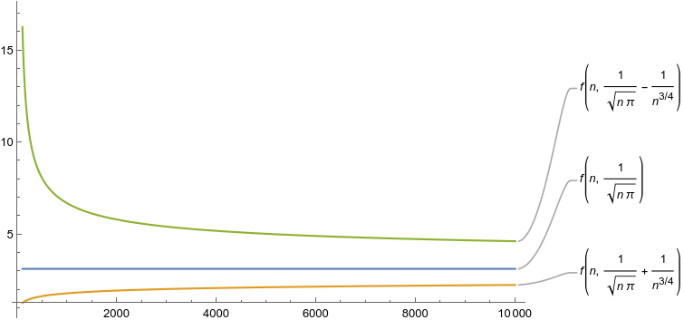

__Code 1:__ looking at ``plop()``, we see that x,y are independent uniform random variables in [0,1], and we return 1 if the vector (x,y) has Euclidean norm at most 1. What is the probability that this happens? We're picking a point uniformly in the top right square, which has area 1, and looking at the probability to land into the circle (of radius r=1), whose intersection with that square is a fourth of the total circle area, so πr²/4 = π/4.


```python
def plop():
    (x,y) = rng.random(2) 
    return int(x**2+y**2 <= 1)
def plops(n): # First thing
    return sum([4*plop()/n for _ in range(n)])
```

So each draw of plop() is 1 with probability π/4: ``plops()`` then computes the empirical mean of n such independent draws, multiplies it by 4, and... we get something whose expected value is π/4*4=π 🥧! Moreover, since we're basically looking at the empirical mean of a bunch of independent Bernoulli random variables (a.k.a. a (scaled) Binomial), we get by [Hoeffding](https://en.wikipedia.org/wiki/Hoeffding%27s_inequality)/[Chernoff](https://en.wikipedia.org/wiki/Chernoff_bound#Sums_of_independent_Bernoulli_random_variables) bounds that this converges to π *really* fast.

__Code 2:__ ``fleb()`` picks an integer between 1 and n uniformly at random, and returns 1 if it's prime. What is the probability that this happens? It's entirely obvious, but the [Prime Number Theorem (PNT)](https://en.wikipedia.org/wiki/Prime_number_theorem) guarantees that, as n goes to infinity, this behaves as 1/ln(n). More precisely, if π(n) [Yes, π... but not that π 🥧!] denotes the number of prime numbers in {1,..,n}, then the PNT states that 
$$\frac{\pi(n) \ln (n)}{n} \to 1
$$

```python
def fleb(n):
    x = rng.integers(1,n+1)
    return int(is_prime(x))
def flebs(n): # Second thing
    return sum([fleb(n+1)*np.log(n+1)/n for _ in range(n)])
```

How fast does it get there? It doesn't say 🤷. But "we" [not me] can get quantitative bounds, and it gets there quite fast: https://en.wikipedia.org/wiki/Prime_number_theorem#Non-asymptotic_bounds_on_the_prime-counting_function
Now, what does ``flebs()`` do? Given a (large enough?) n, it tries to estimate that probability to be prime, $\frac{\pi(n+1)}{n+1}$, by random sampling (again, empirical mean of a bunch of Bernoulli... using n+1 instead of n for no particularly good reason) It does that for n attempts, takes the average, _and voilà!_ A very good estimate of the constant... 1. (It converges, again, very fast! To 1. 🧐)

💡 Note that there is no particular reason to use the same n for both the "large number in ``fleb()`` *and* the number of repetitions to do the statistical estimate. They are absolutely not tied to each other, but that quiz didn't try **not** to confuse you 🙃. To be more precise, for a given n, each call to ``fleb(n+1)`` is a Bernoulli with parameter $\frac{\pi(n+1)}{n+1}\approx 1/\ln n$ (this is what we are trying to estimate), and so also with variance $\sigma^2 \approx 1/ln n$. If we were to take the empirical mean over $N$ repetitions, we'd get an estimator with variance $\sigma^2/N \approx 1/(N\ln n)$, so we expect it to oscillate around its mean by a few standard deviations, so $O(1/\sqrt{N\log n})$. For our choice of $N=n$, that gives an estimate of $\frac{\pi(n+1)}{n+1}$ within $\pm O(1/\sqrt{n\log n})$, so an estimate of $1$ within $\pm O(\sqrt{\log n/n})$.

__Code 3:__ Oh, I like that one, and [it's not the first time I mentioned it!](https://twitter.com/ccanonne_/status/1331534438770020353). There is a very [nice probability fact](https://en.wikipedia.org/wiki/Coprime_integers#Probability_of_coprimality), which has a very easy heuristic but "wrong" proof (and a not-so-easy correct one to make it formal) which states that the probability
$$
p_n = \Pr[ \textrm{gcd}(x,y) = 1 ]
$$
that two independent and uniformly random integers in {1,..,n} are coprime goes to 6/π² as n grows. So ``blah()``, armed with that fact, picks two such integers, and returns 1 iff they are coprime, proudly returning a Bernoulli r.v. with parameter $p_n$.

```python
def blah(n):
    (x,y) = rng.integers(1,n+1, size=2)
    return int(np.gcd(x,y) == 1)
def blahs(n):  # Third thing
    return np.sqrt(6.0/sum([blah(n)/n for _ in range(n)]))
```
Then ``blahs()`` does that a bunch of time and takes the empirical mean (again using for not particular reason the same number n for "large integer" and "number of experiments to get a good estimate": I didn't try to make your task easy! 👀), thus estimating $p_n$ to accuracy roughly O(1/√n). Which results, fingers crossed, to a good estimate of 6/π² as well: the hope being that "estimate ≈ $p_n$ ≈ 6/π²".

And then... we take the inverse of our estimate, multiply it by 6, take the square root, and tadam! An estimate of π 🥧!

__Code 4__: Ah, ``meeps()``. What does it do? Surprise: it estimates π 🥧, again – but *very* badly! Basically, ``meep(n)`` generates a uniformly random $2n$-bit string $x$, and returns 1 iff $x$ has exactly $n$ bits set to $1$ (that is, has Hamming weight $n$).


```python
def meep(n):
    x = rng.integers(2, size=2*n)
    return int(sum(x) == n)
def meeps(n):  # Fourth thing
    return 1/(n*sum([meep(n)/n for _ in range(n)])**2)
```

What's the probability that this happens? Exactly the probability that a Binomial r.v. $X$ with parameters $2n$ and $1/2$ is equal to $n$,
$$\Pr[X = n] = \binom{2n}{n}\frac{1}{2^{2n}}$$
That... does not look to great, does it? Fortunately, using [Stirling's approximation](https://en.wikipedia.org/wiki/Stirling%27s_approximation), we get that for large $n$
$$\Pr[X = n]  = \frac{(2n)!}{2^{2n}(n!)^2}\sim \frac{1}{\sqrt{\pi n}}
$$
Also, that approximation is really, *really* good. So again, ``meeps()`` calls ``meep()`` n times, takes the inverse, multiplies by n and squares the whole thing to go from an estimate of $\frac{1}{\sqrt{\pi n}}$ to an estimate of 🥧. But then why is the result so bad, if Stirling's approximation is so good? 🤔

Let's look at the quality of our estimate, when for a fixed n we take the sample mean over N repetitions (for us, N=n, but again — that's arbitrary). By the above, we estimate the parameter $p_n$ of a Bernoulli, which is approximately $\frac{1}{\sqrt{\pi n}}$, and so has variance $\sigma^2 \approx \frac{1}{\sqrt{\pi n}}$ as well. We end up with a sample mean with mean variance $\sigma^2/N = \Theta(1/(\sqrt{n}N))$, which for $N=n$ is $\Theta(1/n^{3/2})$. The estimator will fluctuate by something of the order of a standard deviation around its mean, so we'll get
$$\frac{1}{\sqrt{\pi n}} \pm \Theta( \frac{1}{n^{3/4}} )$$
Still, it's big, but not **too** bad, right? Err.... we're not done. Once we have that estimate $\hat{p}_n$ of our parameter $p_n$, we want to extract the value of $\pi$, so we apply the function $f(x) = \frac{1}{nx^2}$ to $\hat{p}_n$. And that's... not great! A Taylor series approximation shows that
$$f(\frac{1}{\sqrt{\pi n}}\pm \frac{1}{n^{3/4}}) \approx \pi \pm \frac{2\pi^{3/2}}{n^{1/4}} $$
so now we have an error of the order $\Theta(1/n^{1/4})$ around our estimate of $\pi$, not something behaving as $1/\sqrt{n}$ or so like for the others! 😬



__Code 5__: I like ``blop()``. It chooses a uniformly random permutation π of {1,2,...,n} (no, nope, not *that* π!), and then counts the number of fixed points of π, that is how many i such that π(i)=i. Then it returns 1 if, and only if, there is no fixed point.

```python
def blop(n):
    p = rng.permutation(n)
    return int( sum([ int(i==p[i]) for i in range(n) ]) == 0 )
def blops(n):  # Fifth thing
    return 1.0/sum([blop(n)/n for _ in range(n)])
```
So what is this supposed to do? Here's a fun fact: as n goes to ∞, [the number of fixed points of a uniformly random permutation converges to the Poisson distribution with parameter λ=1](https://math.stackexchange.com/questions/140751/random-permutation-poisson-proof). (Fun exercise: proving that the *expected* number of fixed points is 1 is [very easy, and a nice exercise](https://math.stackexchange.com/a/3985571/75808)). So What does that imply? That tells us that the probability to have 0 fixed points should converge to $e^{-1}$. which is the probability that a Poisson(1) r.v. equals 0! And yes: ``blops()`` calls ``blop()`` many times, uses that to get an estimate of $1/e$, then takes the inverse to **estimate Euler's number, $e$.**
