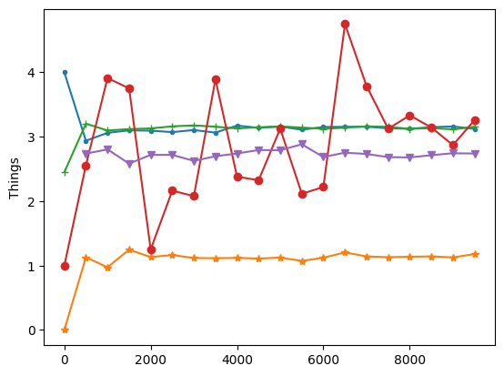

```python
import numpy as np
np.seterr(divide='ignore');
```


```python
def is_prime(n):
    return n > 1 and all(n % i for i in range(2, int(np.sqrt(n) + 1)))
```


```python
rng = np.random.default_rng()
```


```python
def plop():
    (x,y) = rng.random(2) 
    return int(x**2+y**2 <= 1)
def plops(n): # First thing
    return sum([4*plop()/n for _ in range(n)])
```


```python
def fleb(n):
    x = rng.integers(1,n+1)
    return int(is_prime(x))
def flebs(n): # Second thing
    return sum([fleb(n+1)*np.log(n+1)/n for _ in range(n)])
```


```python
def blah(n):
    (x,y) = rng.integers(1,n+1, size=2)
    return int(np.gcd(x,y) == 1)
def blahs(n):  # Third thing
    return np.sqrt(6.0/sum([blah(n)/n for _ in range(n)]))
```


```python
def meep(n):
    x = rng.integers(2, size=2*n)
    return int(sum(x) == n)
def meeps(n):  # Fourth thing
    return 1/(n*sum([meep(n)/n for _ in range(n)])**2)
```


```python
def blop(n):
    p = rng.permutation(n)
    return int( sum([ int(i==p[i]) for i in range(n) ]) == 0 )
def blops(n):  # Fifth thing
    return 1.0/sum([blop(n)/n for _ in range(n)])
```


```python

```


```python
import matplotlib.pyplot as plt;
xrange = np.arange(1,10000,500);
plt.plot(xrange, [plops(n) for n in xrange], marker=".");
plt.plot(xrange, [flebs(n) for n in xrange], marker="*");
plt.plot(xrange, [blahs(n) for n in xrange], marker="+");
plt.plot(xrange, [meeps(n) for n in xrange], marker="o");
plt.plot(xrange, [blops(n) for n in xrange], marker="v");
plt.ylabel('Things');
plt.show();
```


    

    

📝 [Solutions](https://ccanonne.github.io/quizzes/13012023-things-solutions)

```python

```
